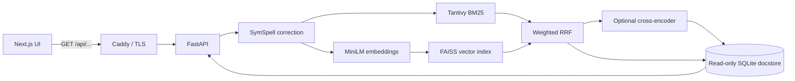
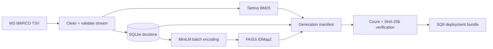

# Hybrid Search Engine

---

> A production-oriented retrieval platform combining Tantivy BM25, FAISS semantic search, weighted RRF, and cross-encoder reranking over 1,499,977 MS MARCO passages.

[](https://github.com/goldenk23/Hybrid-search-engine/actions/workflows/ci.yml)     

Built to answer a practical systems question: **how do you improve retrieval quality while keeping latency, storage, reproducibility, and operational failure modes visible?**

## Results at a glance

- **0.7289 NDCG@10 / 0.6880 MRR@10** with cross-encoder reranking on its 200-query evaluation subset.
- **0.9571 Recall@100** with weighted Reciprocal Rank Fusion (RRF) on 268 answerable queries.
- **38.64 ms p50** for BM25 and **321.58 ms p50** for exact vector retrieval in the recorded local benchmark.
- **74.6% smaller vector artifact** after FAISS SQ8 quantization: 2,208.68 MiB to 560.75 MiB.
- Reproducible indexing and benchmarking with checkpoints, fixed cohorts, frozen dependencies, artifact manifests, and SHA-256 verification.

> These are local, single-process measurements—not production SLAs. See [Benchmark methodology and limitations](#benchmark-methodology-and-limitations) for the exact scope.

## Why this project is more than a search demo

Most search demos stop after returning semantically similar text. This project also addresses the engineering around retrieval:

- **Multiple retrieval stages:** Tantivy BM25, SentenceTransformer embeddings, exact FAISS search, weighted RRF, and optional cross-encoder reranking.
- **Measured relevance:** NDCG@10, MRR@10, Recall@100, p50/p95 latency, and artifact size are recorded from a fixed evaluation cohort.
- **Safe long-running indexing:** streaming ingestion, 25,000-document checkpoints, resumability, and durable-index-before-checkpoint ordering.
- **Artifact integrity:** document counts, generation IDs, embedding provenance, and cross-platform SHA-256 fingerprints are checked before serving.
- **Production packaging:** non-root containers, read-only backend filesystem, health-gated startup, resource limits, TLS reverse proxy, compressed indexes, and frozen lockfiles.
- **Operational visibility:** liveness, readiness, optional Prometheus metrics, structured API errors, and explicit overload behavior for reranking.

## Architecture



### Query path

1. The API validates the query and applies spelling correction.
2. **BM25** retrieves exact lexical matches while **FAISS** retrieves semantically similar passages from normalized MiniLM embeddings.
3. **Weighted RRF** merges ranks without assuming that BM25 and cosine scores share a scale:

   ```text
   RRF(d) = Σ weight(source) / (k + rank(source, d))
   ```

4. The optional **cross-encoder** jointly scores the query and top hybrid candidates for higher-precision final ordering.
5. Passage IDs are batch-hydrated from a read-only, zlib-compressed SQLite docstore. Full bodies are omitted unless requested.

### Indexing path



Real MS MARCO passage IDs are stored inside `FAISS IndexIDMap2`; there is no parallel ID sidecar that can drift out of sync. Interrupted indexing resumes from durable state, and the final generation is accepted only when BM25, FAISS, and the docstore agree on document count.

## Benchmark results

Recorded against **1,499,977 indexed passages** using a committed MS MARCO-derived cohort. Each retrieval query ran five times after warm-up; per-query medians were aggregated into p50/p95 latency.

| Retrieval system | Queries | NDCG@10 | MRR@10 | Recall@100 | p50 | p95 |
|---|---:|---:|---:|---:|---:|---:|
| BM25 | 268 | 0.4167 | 0.3621 | 0.7774 | 38.64 ms | 62.36 ms |
| Exact vector | 268 | 0.6069 | 0.5522 | 0.9459 | 321.58 ms | 458.77 ms |
| Hybrid RRF (1.0 / 1.0) | 268 | 0.5646 | 0.5043 | 0.9496 | 359.74 ms | 535.20 ms |
| Weighted RRF (0.50 / 1.00) | 268 | 0.5948 | 0.5371 | **0.9571** | 520.12 ms | 712.38 ms |
| Weighted RRF (0.25 / 1.00) | 268 | 0.6016 | 0.5407 | 0.9459 | 360.18 ms | 557.29 ms |
| Hybrid + cross-encoder¹ | 200 | **0.7289** | **0.6880** | 0.8625 | 1,353.55 ms | 1,676.01 ms |

| Artifact | Size |
|---|---:|
| Tantivy BM25 | 284.28 MiB |
| Exact FAISS vectors | 2,208.68 MiB |
| FAISS SQ8 vectors | 560.75 MiB |
| Compressed SQLite docstore | 368.95 MiB |
| Deployable BM25 + SQ8 + docstore | 1,213.98 MiB |

¹ The reranker was measured on the first 200 eligible queries and returns 10 results, so its recall and latency are not directly comparable with the 268-query top-100 retrieval runs.

### Benchmark methodology and limitations

The benchmark intentionally records enough context to prevent attractive but misleading numbers:

- The fixed source cohort contains 1,000 queries; **268 had judged-relevant passages present in this truncated 1.5M-document corpus**. Reported retrieval quality is conditional on that answerable subset, not the full-corpus MS MARCO leaderboard.
- Three warm-up queries are discarded. Every remaining query runs five times; its median latency contributes to the reported p50/p95. Quality is calculated once from the final repeat.
- Retrieval runs sequentially on Windows 11 with 16 logical CPUs. Results are hardware-specific and do not represent concurrent throughput or a service-level objective.
- The benchmarked retrieval index is exact FlatIP. SQ8 was validated for count, IDs, dimensions, metric, reconstruction similarity, and storage size, but its retrieval quality and latency were **not** measured in this run.
- The recorded run used a dirty working tree. The cohort hash, package versions, arguments, generation ID, and raw output remain available for audit, but a clean rerun would provide stronger commit-level reproducibility.

Raw evidence and the executable benchmark live in [`Benchmark/results/1.5M.json`](hybrid-search-engine/Benchmark/results/1.5M.json) and [`Benchmark/benchmark_retrieval.py`](hybrid-search-engine/Benchmark/benchmark_retrieval.py).

## Key engineering decisions

| Decision | Why | Trade-off |
|---|---|---|
| BM25 + vector retrieval | Lexical search handles exact terms; embeddings handle vocabulary mismatch | Two indexes increase build time and storage |
| Weighted RRF | Combines rank positions without fragile score normalization | Weights require evaluation; fusion does not learn from feedback |
| Exact FAISS FlatIP baseline | Establishes a quality reference with deterministic exhaustive search | O(N) vector scan limits scale and raises latency |
| Cross-encoder only after retrieval | Spends expensive joint inference on a small candidate set | Best measured quality, but ~1.35 s local p50 |
| SQLite for immutable passage bodies | Simple, local, transactional, and efficient for ID-based reads | Not designed for distributed writes or horizontal serving |
| SQ8 deployment artifact | Cuts vector storage by 74.6% and lowers deployment footprint | Requires separate quality/latency validation before making equivalence claims |
| One backend worker | Avoids duplicating FAISS and model memory inside one container | Scale-out requires additional replicas and a load balancer |
| Fail-closed production manifests | Prevents serving mismatched indexes or embedding revisions | Deployment must stage complete, pinned artifacts correctly |

## Reliability and production behavior

- **Startup validation:** completeness, counts, hashes, and optionally pinned model revision must match before readiness succeeds.
- **Crash-safe state:** manifests and checkpoints use atomic replacement; the durable index advances before checkpoint metadata.
- **Backpressure:** one non-blocking rerank slot protects memory/CPU; excess rerank traffic receives HTTP `429` rather than building an unbounded queue.
- **Health model:** liveness reports process health; readiness remains false until models and indexes are loaded.
- **Container hardening:** non-root users, read-only backend root filesystem, `tmpfs`, memory/CPU limits, health checks, and rotated logs.
- **Edge gateway:** Caddy provides TLS, compression, security headers, reverse proxying, and hides metrics/OpenAPI routes from the public path.
- **CI:** locked backend/frontend installs, Ruff, pytest, frontend lint/build, and Docker builds for both production images.

## Technology stack

| Layer | Technologies |
|---|---|
| Retrieval | Tantivy BM25, FAISS CPU, Sentence Transformers, weighted RRF, cross-encoder reranking, SymSpell |
| Backend | Python 3.11, FastAPI, Pydantic, Uvicorn, SQLite, NumPy |
| Frontend | Next.js 16, React 19, TypeScript, Tailwind CSS |
| Quality | pytest, Ruff, fixed-cohort IR benchmarks, Locust scenario |
| Delivery | Docker, uv lockfile, pnpm lockfile, GitHub Actions, Caddy |

## Run locally

### Prerequisites

- Python 3.11+
- Node.js 22+
- pnpm
- Existing indexes, or sufficient time and disk space to build them

### Backend

```powershell
Set-Location .\hybrid-search-engine
py -3.11 -m venv .venv
.\.venv\Scripts\python.exe -m pip install -e ".[dev,metrics]"
.\.venv\Scripts\python.exe manage.py status
.\.venv\Scripts\python.exe manage.py serve
```

The API starts at `http://127.0.0.1:8000`; Swagger UI is available locally at `/docs`. Existing complete artifacts can be used immediately. To create a fresh 1.5M-passage generation:

```powershell
.\.venv\Scripts\python.exe manage.py setup --max-docs 1500000
```

Indexing is compute-, storage-, and network-intensive. Re-running the command resumes interrupted work.

### Frontend

```powershell
Set-Location .\hybrid-search-engine-frontend
pnpm install --frozen-lockfile
$env:NEXT_PUBLIC_API_BASE_URL = "http://127.0.0.1:8000"
pnpm dev
```

Open `http://localhost:3000`. For reranked mode, set `ENABLE_RERANKER=true` before starting the backend.

For detailed indexing, benchmark, smoke-test, and deployment commands, see [`USAGES.md`](USAGES.md).

## API

| Endpoint | Purpose |
|---|---|
| `GET /search?q=...&top_k=10` | BM25 keyword retrieval |
| `GET /hybrid-search?q=...&top_k=10` | BM25 + vector + weighted RRF |
| `GET /hybrid-search/rerank?q=...&top_k=10&candidates_k=100` | Hybrid candidate retrieval + cross-encoder reranking |
| `GET /health/live` | Process liveness |
| `GET /health/ready` | Model/index readiness |
| `GET /metrics` | Prometheus metrics when the optional dependency is installed |

Example:

```powershell
Invoke-RestMethod `
  'http://127.0.0.1:8000/hybrid-search?q=what%20causes%20rain&top_k=10&bm25_weight=0.5&vector_weight=1&rrf_k=60'
```

Responses expose the original/corrected query, measured backend latency, result count, snippets, source ranks, and retrieval-stage scores. Full passage bodies are opt-in with `include_body=true`.

## Verification

Run the same checks used by CI:

```powershell
# Backend
Set-Location .\hybrid-search-engine
uv sync --frozen --extra dev --extra metrics
uv run ruff check src tests scripts Benchmark
uv run pytest -q

# Frontend
Set-Location ..\hybrid-search-engine-frontend
pnpm install --frozen-lockfile
pnpm lint
$env:NEXT_PUBLIC_API_BASE_URL = "/api"
pnpm build
```

A smoke test against a running backend is also available:

```powershell
.\.venv\Scripts\python.exe manage.py smoke --query "how does photosynthesis work"
```

## Repository layout

```text
.
├── hybrid-search-engine/
│   ├── src/api/            # FastAPI lifecycle, routes, schemas, health, metrics
│   ├── src/search/         # BM25, FAISS, RRF, hybrid retrieval, reranker
│   ├── src/indexing/       # preprocessing, checkpoints, manifests, pipelines
│   ├── src/database/       # compressed SQLite document store
│   ├── src/evaluation/     # NDCG, MRR, and recall metrics
│   ├── Benchmark/          # fixed cohorts, benchmark drivers, saved results
│   ├── scripts/            # data, index, and deployment-artifact tooling
│   └── tests/              # unit and API tests with lightweight fakes
├── hybrid-search-engine-frontend/
│   ├── app/                # Next.js application
│   ├── components/         # search and result UI
│   └── lib/                # typed API client
├── .github/workflows/ci.yml
└── USAGES.md               # complete operator guide
```

## Current boundaries

This is a deliberately focused single-node design. It has no distributed index sharding, result cache, authentication layer, or general-purpose rate limiter. Exact vector search is the current latency bottleneck, while cross-encoder inference is deliberately concurrency-limited. The next scale-oriented step would be to benchmark an ANN index against the exact baseline, then add replicas and traffic-level load results before claiming higher throughput.

Those boundaries are explicit because production engineering is not only about what a system can do—it is also about knowing where its guarantees end.

## Dataset

The project uses the [MS MARCO Passage Ranking dataset](https://microsoft.github.io/msmarco/). Dataset content and models remain subject to their respective licenses and terms. Generated indexes and model caches are intentionally excluded from source control.

---

If you are reviewing this project in an interview, the most useful discussion areas are the **RRF choice**, **benchmark comparability**, **crash-safe indexing protocol**, **artifact provenance checks**, and the **quality/latency/storage trade-offs** between exact retrieval, quantization, and reranking.